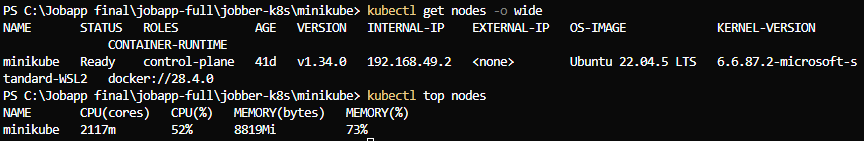

# Images for Cluster Autoscaler

Place screenshots in the `images/` folder and reference the images in the main READMEs using Markdown syntax.

## Structure

```
ca/
├── README.md          ← This file (guide)
└── images/            ← Save images here
    ├── ca-initial-state.png
    ├── ca-pending-pods.png
    └── ...
```

## How to reference in READMEs

Use this syntax in the main READMEs:

```markdown

```

## Suggested images:

1. **ca-initial-state.png** - Initial cluster state (1 node)
   ```bash
   kubectl get nodes
   kubectl get pods -n production -o wide
   ```
   Reference: ``

2. **ca-pending-pods.png** - Pods in Pending state before scaling
   ```bash
   kubectl get pods -n production | grep Pending
   ```
   Reference: ``

3. **ca-logs-scaling.png** - CA logs showing scaling decision
   ```bash
   kubectl -n kube-system logs deployment/cluster-autoscaler | grep -i "scale\|node"
   ```
   Reference: ``

4. **ca-new-node.png** - New node created
   ```bash
   kubectl get nodes
   ```
   Reference: ``

5. **ca-pods-distributed.png** - Pods distributed across both nodes
   ```bash
   kubectl get pods -n production -o wide
   ```
   Reference: ``

6. **ca-scale-down.png** - Scale down (when load decreases)
   ```bash
   kubectl -n kube-system logs deployment/cluster-autoscaler | grep -i "scale down"
   ```
   Reference: ``
