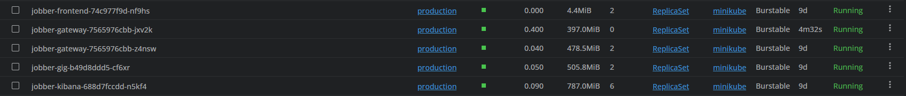

## Guía de HPA para `jobber-gateway`

Esta nota describe cómo habilitar, verificar y probar el Horizontal Pod Autoscaler (HPA) del gateway con enfoque de arquitectura backend. Los mismos pasos aplican en Minikube (laboratorio) y en EKS (demo/productivo). Mantén los manifiestos versionados junto al servicio para repetir el procedimiento en cualquier entorno.

---

### 1. Prerrequisitos

- `kubectl` configurado contra el clúster deseado (`production` namespace).
- Requests/limits ya definidos en el `Deployment` (`jobber-gateway` expone `requests.cpu: 100m`, `requests.memory: 150Mi`).
- Conectividad de administrador para instalar componentes en `kube-system`.
- PowerShell 5+ (para el script de carga) con permisos para ignorar certificados self-signed en entornos de prueba.

---

### 2. Instalar Metrics Server (una vez por clúster)

```powershell
helm repo add metrics-server https://kubernetes-sigs.github.io/metrics-server/
helm upgrade --install metrics-server metrics-server/metrics-server `
  --namespace kube-system `
  --create-namespace `
  --set "args={--kubelet-insecure-tls,--kubelet-preferred-address-types=InternalIP}"
```
> Si PowerShell no respeta las líneas con acentos graves, ejecuta todo en una sola línea:
> `helm upgrade --install metrics-server metrics-server/metrics-server --namespace kube-system --create-namespace --set "args={--kubelet-insecure-tls,--kubelet-preferred-address-types=InternalIP}"`

Validar disponibilidad:

```powershell
kubectl get deployment metrics-server -n kube-system
kubectl get apiservices v1beta1.metrics.k8s.io
kubectl top nodes
```

> Resultado esperado: `AVAILABLE 1` en el deployment y `AVAILABLE True` en el APIService.

---

### 3. Aplicar el HPA del gateway

Manifiesto: `jobber-k8s/AWS/1-gateway/hpa.yaml`

```powershell
kubectl apply -f jobber-k8s/AWS/1-gateway/hpa.yaml
kubectl get hpa jobber-gateway -n production
```

Parámetros actuales:

- `minReplicas: 1`
- `maxReplicas: 2`
- `target` CPU = 70 % (sobre `requests.cpu: 100m`)

---

### 4. Probar escalado automático

1. **Monitor en vivo**
   ```powershell
   kubectl get hpa jobber-gateway -n production -w
   ```
   - `kubectl get hpa … -w` muestra en tiempo real cómo cambian `CURRENT`, `TARGET` y `REPLICAS`. Úsalo durante pruebas de carga para observar cuándo se dispara el escalado.

2. **Generar carga desde PowerShell**
   ```powershell
   for ($i=0;$i -lt 2000;$i++){
     try {
       Invoke-WebRequest -Uri "https://api.jobberapp.kevmendeveloper.com/api/gateway/v1/gateway-health" `
                         -Method GET `
                         -SslProtocol Tls12 `
                         -UseBasicParsing `
                         -TimeoutSec 5 `
                         -SkipCertificateCheck | Out-Null
     } catch {
       Write-Host "Request $i failed: $($_.Exception.Message)"
     }
     Start-Sleep -Milliseconds 100
   }
   ```

   Ajusta la URL según el entorno (Ingress público, `minikube tunnel`, service interno).
   > Si no se ejecuta por los saltos de línea, usa la versión en una sola línea:
   > `for ($i=0;$i -lt 2000;$i++){ try { Invoke-WebRequest -Uri "https://api.jobberapp.kevmendeveloper.com/api/gateway/v1/gateway-health" -Method GET -SslProtocol Tls12 -UseBasicParsing -TimeoutSec 5 -SkipCertificateCheck | Out-Null } catch { Write-Host "Request $i failed: $($_.Exception.Message)" }; Start-Sleep -Milliseconds 100 }`

3. **Observar consumo**
   ```powershell
   kubectl top pods -n production
   ```
   - `kubectl top pods …` refleja CPU/RAM actuales. Es clave para confirmar que la carga realmente está empujando los pods hacia el umbral.

4. **Inspeccionar estado detallado**
   ```powershell
   kubectl describe hpa jobber-gateway -n production
   ```
   - `kubectl describe` muestra los cálculos que está usando el HPA, la última vez que escaló y los eventos. Útil si parece “atascado” o hay warnings.

Escenario esperado:

- Cuando `CURRENT` ≥ `70%`, el HPA escala el deployment a 2 réplicas (`kubectl get deploy jobber-gateway -n production` → `READY 2/2`).
- Al cesar la carga, el HPA mantiene la réplica extra durante ~5 minutos (ventana de estabilización por defecto) y luego la elimina automáticamente si el promedio de CPU se mantiene por debajo del objetivo.

---

### 5. Comprobaciones clave

- `kubectl describe hpa jobber-gateway -n production`  
  Revisa `Metrics:` (porcentaje actual) y `Events:` (registro de escalados).
- `kubectl get deploy jobber-gateway -n production -o yaml | Select-String replicas`  
  Útil para confirmar que el objetivo vuelve a 1.
- `kubectl logs deploy/metrics-server -n kube-system`  
  Si `kubectl top` falla, inspecciona el pod del Metrics Server.

---

### 6. Buenas prácticas de arquitectura

- **Requests realistas**: ajusta `requests.cpu`/`memory` con base en métricas reales (Prometheus/APM) para que el HPA reaccione al umbral correcto.
- **Margen en el nodo**: aunque el HPA cree una réplica adicional, asegúrate de que el nodo (ej. `t3.medium`) dispone de CPU/RAM suficientes. Si planeas usar `t3.small`, monitoriza `kubectl top nodes`.
- **Coordinación con CA**: cuando migres a EKS con Cluster Autoscaler (CA), el HPA seguirá creando pods y el CA añadirá nodos si no hay capacidad. Documenta ambos flujos para evitar sorpresas.
- **Escenario demo**: escala el nodegroup a 0 fuera de horario para ahorrar costes, pero deja el HPA activo; al reactivar el clúster, reaplica `hpa.yaml` junto a los deployments.

---

### 7. Troubleshooting rápido

| Síntoma | Diagnóstico | Acción |
| --- | --- | --- |
| `kubectl top` devuelve error | Metrics Server caído o sin permisos | `kubectl get deployment metrics-server -n kube-system`, revisar logs |
| HPA siempre en `unknown/70%` | Métricas no llegan | Ver `kubectl describe hpa ...`, reiniciar Metrics Server |
| No escala pese a alta carga | `requests.cpu` demasiado altos o tráfico insuficiente | Recalibrar requests y repetir prueba |
| Réplica extra no desaparece | Métrica promedio aún por encima del target | Esperar ventana de estabilización (~5 min) o escalar manualmente |

---

### 8. Capturas de pantalla para documentación

Guarda las capturas en la carpeta `images/` dentro de esta misma carpeta y referencia las imágenes usando sintaxis Markdown.

**Ubicación de las imágenes**: `jobber-k8s/AWS/autoscaling/hpa/images/`

#### Imágenes documentadas:

1. **Estado inicial del HPA** (1 réplica, CPU baja)
   ```bash
   kubectl get hpa jobber-gateway -n production
   kubectl top pods -n production
   ```
   
   - Ruta: `images/hpa-before-load.png`

2. **HPA durante la carga** (CPU aumentando)
   ```bash
   kubectl get hpa jobber-gateway -n production -w
   kubectl top pods -n production
   ```
   
   - Ruta: `images/hpa-during-load.png`

3. **HPA escalado a 2 réplicas**
   ```bash
   kubectl get hpa jobber-gateway -n production
   kubectl get deploy jobber-gateway -n production
   ```
   
   - Ruta: `images/hpa-scaled-up.png`

4. **Describe detallado del HPA**
   ```bash
   kubectl describe hpa jobber-gateway -n production
   ```
   
   - Ruta: `images/hpa-describe.png`

5. **Consumo de recursos durante la prueba**
   ```bash
   kubectl top pods -n production
   ```
   
   - Ruta: `images/hpa-kubectl-top.png`

6. **HPA escalando hacia abajo**
   ```bash
   kubectl get hpa jobber-gateway -n production
   ```
   
   - Ruta: `images/hpa-scale-down.png`

7. **HPA después de la carga** (vista desde Lens)
   
   - Ruta: `images/hpa-after-load-lens.png`

---

### 9. Checklist para producción/demo

- [ ] Metrics Server instalado y sano.
- [ ] `hpa.yaml` aplicado en todos los entornos.
- [ ] Scripts de prueba listos para demostrar escalado en vivo.
- [ ] Monitoreo (APM, Prometheus) validado para alertar cuando el HPA cree nuevas réplicas.
- [ ] Documentado en `capacity-planning-demo.md` el comportamiento previsto (min 1 / max 2 replicas).
- [ ] Capturas de pantalla guardadas en `docs/hpa/` para documentación del portafolio.

Con esto, `jobber-gateway` queda protegido ante picos de CPU sin sacrificar simplicidad ni presupuesto en un clúster pequeño.

